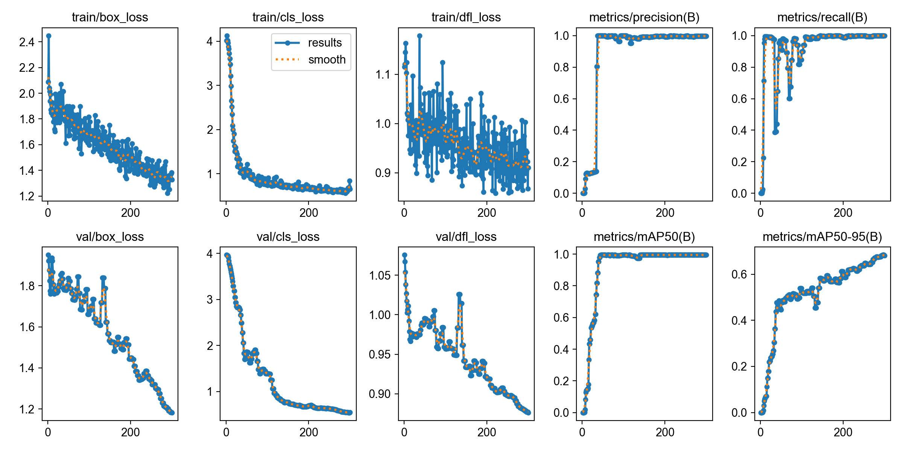

# 📝 AI OMR Grader - Corretor Automático de Gabaritos

Este projeto utiliza Visão Computacional e Inteligência Artificial para realizar a leitura automática de gabaritos de provas. O modelo foi treinado para identificar 10 questões (de A a D) e converter a imagem em um objeto de dados JSON.

## 🚀 Tecnologias Utilizadas
*   **Python 3.9+**
*   **YOLOv8n** (Ultralytics): Modelo de detecção de objetos leve e rápido.
*   **OpenCV**: Para processamento de imagem e conferência visual.
*   **MakeSense.ai**: Ferramenta web para anotação do dataset.
*   **MacBook Air M4**: Hardware utilizado para treinamento (utilizando aceleração MPS).

---

## 🛠️ Passo a Passo do Projeto

### 1. Preparação do Dataset (Estratégia de Anotação)
Inicialmente, tentamos treinar o modelo com 40 classes específicas (1a, 1b, etc.), mas com poucas imagens o modelo não obteve confiança. 
**A estratégia vencedora** foi treinar o modelo para reconhecer apenas duas classes universais:
*   `marcado`: Bolinha preenchida pelo aluno.
*   `vazio`: Bolinha em branco.

Foram anotadas 160 bolinhas em 4 imagens de gabaritos reais para garantir que a IA aprendesse a diferença visual entre preenchimento e papel limpo.

### 2. Estrutura de Pastas
O projeto foi organizado seguindo o padrão exigido pelo YOLOv8:
```text
treino_gabarito/
├── dataset/
│   ├── images/
│   │   └── train/ (Fotos dos gabaritos)
│   └── labels/
│       └── train/ (Arquivos .txt das anotações)
├── data.yaml        (Configuração das classes)
├── treinar.py       (Script de treinamento)
└── run.py        (Script de leitura e lógica)
```

### 3. Treinamento
O treinamento foi realizado localmente utilizando o chip **Apple M4**. Foram executadas 300 épocas para garantir a convergência das métricas de precisão.

**Arquivo `data.yaml`:**
```yaml
nc: 2
names: ['marcado', 'vazio']
```

### 4. Lógica de Processamento (Geometria e Negócio)
Após a IA detectar as 40 bolinhas, o script executa a seguinte lógica:
1.  **Ordenação Vertical (Eixo Y):** Agrupa as bolinhas de 4 em 4 para definir as questões de 1 a 10.
2.  **Ordenação Horizontal (Eixo X):** Dentro de cada questão, identifica qual bolinha corresponde a D, C, B ou A.
3.  **Validação de Respostas:**
    *   **1 marcação:** Retorna a letra correspondente.
    *   **0 marcações ou múltiplas:** Retorna `null` (questão inválida/rasurada).

---

## 🖥️ Como Executar

### Instalação
```bash
python3 -m pip install ultralytics opencv-python
```

### Treinamento
```bash
python3 treinar.py
```

### Teste e Geração de Resultado
O script de teste gera uma imagem de conferência (`conferencia_final.png`) e imprime o resultado no formato:
```json
{
  "1": "A",
  "2": "B",
  "3": null,
  "4": "D"
}
```

---

## 📈 Resultados
O modelo final atingiu alta confiança (acima de 85%) na detecção das bolinhas, processando cada imagem em aproximadamente **25ms** no MacBook M4, permitindo uma correção em tempo real.

 


### Análise dos Gráficos:
*   **Precisão (mAP50):** O modelo atingiu o índice de 1.0 (100%), demonstrando total assertividade na identificação das bolinhas marcadas e vazias.
*   **Estabilidade:** As curvas de perda (*loss*) apresentam queda constante, indicando um aprendizado saudável sem *overfitting* agressivo.
*   **Recall:** A capacidade do modelo de encontrar todas as bolinhas no gabarito foi máxima, garantindo que nenhuma questão seja ignorada durante a correção.